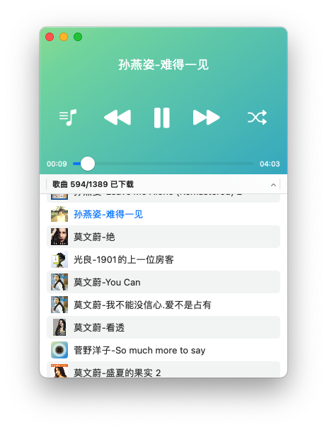

# Cisum

把音频文件放进去，让 Cisum 为你播放和管理。

    
    

<a href="https://cofficlab.github.io/en/cisum" target="_blank">产品介绍</a>

<a href="https://apps.apple.com/cn/app/cisum/id6466401036" target="_blank">App Store(iOS&macOS)</a>

## Why

你在被这些东西毒害吗？

- 开屏广告
- 抖一抖跳转
- 花样繁多的弹窗
- 10秒启动时间
- 眼花缭乱的功能

让软件更纯粹一些，我决定自己做一个。

## For Flutter

https://github.com/CofficLab/CisumPlayer

