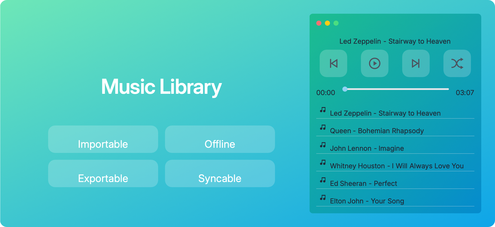

# Cisum

Drop your audio files in, and let Cisum play and manage them for you.

 

## About

[Product Introduction](https://coffic.cn/cisum)

[App Store](https://apps.apple.com/cn/app/cisum/id6466401036)

## Motivation

Are you tired of being bothered by:

- Splash screen ads
- Shake-to-navigate features
- Endless pop-up windows
- 10-second launch times
- Overwhelming features

We decided to make our own app to keep software simple and pure.

## Our Other Projects

- [macOS Network Control](https://github.com/CofficLab/Netto)
- [Git-based Project Management Tool](https://github.com/CofficLab/GitOK)
